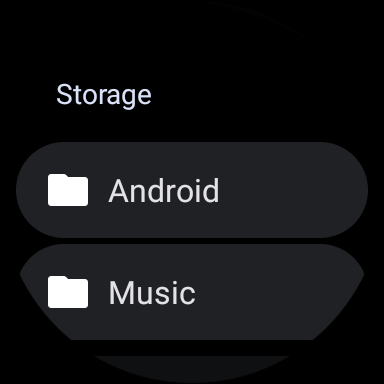

# Wearable File Manager

Manage your files using your wearable device! 📁

## Features

🔹 Designed for Wear OS
🔹 Create, remove, rename, cut, and copy folders and files in your device storage.
🔹 Access your music, photos, videos, and other files.

## Downloads

🔹 [Releases Page](https://github.com/dertefter/WearFiles/releases)