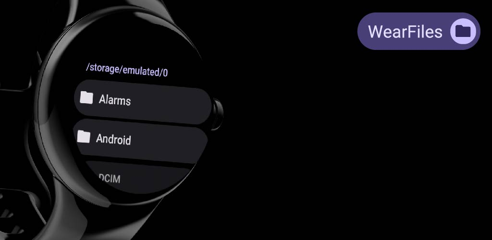
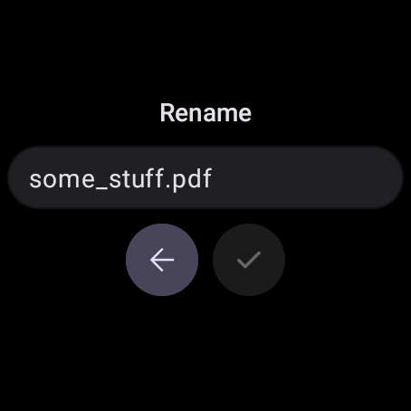

# WearFiles

[](https://play.google.com/store/apps/details?id=com.dertefter.wearfiles)



**WearFiles** is a simple file manager for Wear OS smartwatches.

## 📌 Features
- 📂 View and open files
- 🗑 Delete files
- ✂️ Cut/📋 Copy/📌 Paste files

## ⚠️ Important
Due to Wear OS platform restrictions, the app cannot grant file access permissions on its own. You need to do this manually:

1. Connect your watch to a computer via ADB.
2. Run the following command:

   ```sh
   adb shell appops set --uid com.dertefter.wearfiles MANAGE_EXTERNAL_STORAGE allow
   ```

3. Restart the app.

## 📸 Screenshots

   

