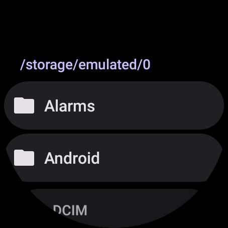
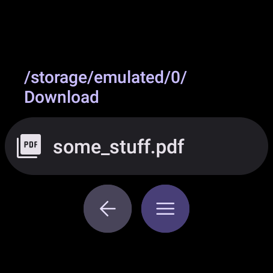
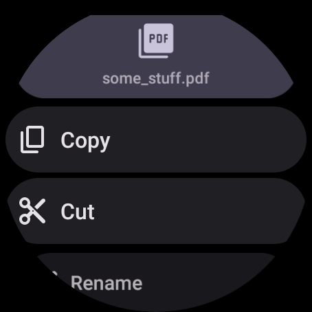

# WearFiles


Простой файловый менеджер для часов на Wear OS.

## 📱 Функции
- 📂 Просмотр и открытие файлов
- 🗑️ Удаление файлов
- ✂️ Вырезать / 📋 Копировать / 📌 Вставить файлы

## ⚠️ Важно
В связи с ограничениями платформы Wear OS приложение не может выдать разрешение для доступа к файлам автоматически.

### 🔧 Как выдать разрешение вручную:
1. Подключите часы к компьютеру через ADB
2. Выполните команду:
   ```sh
   adb shell appops set --uid com.dertefter.wearfiles MANAGE_EXTERNAL_STORAGE allow
   ```
3. Перезапустите приложение

## 📸 Скриншоты
  
  


